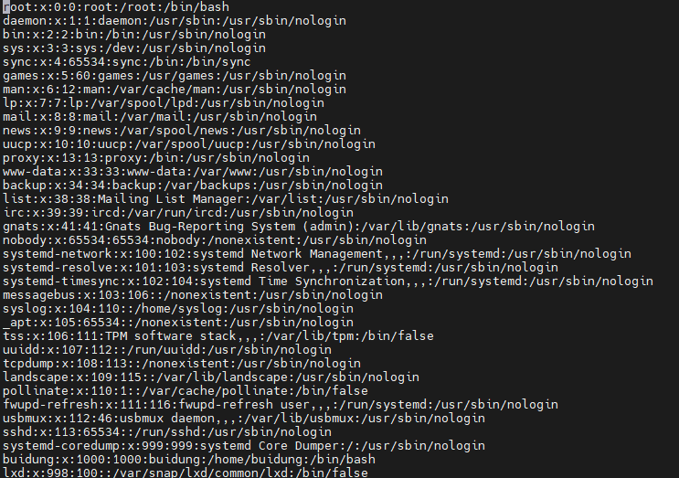
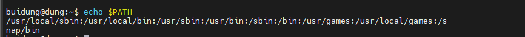
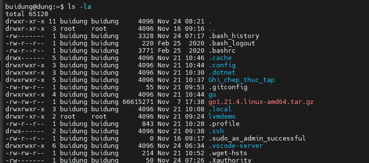
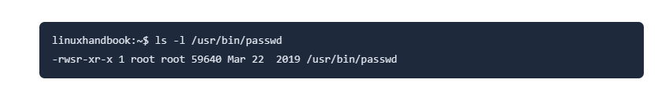
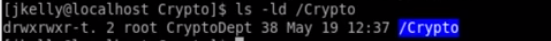

# User và Group trong linux

## Các loại user trong linux:
- Trong hệ điều hành linux có 3 loại user chính: 
 1. **Root**: hay còn gọi là super user, là một loại user có thể thực hiện các tác vụ để quản trị hệ thống như cung cấp quyền cho các loại user khác, cung cấp các chức năng bảo mật cho các file và directory.
 2. **Standard**: là một loại user có thể thực hiện các tác vụ thông thường trong một hệ điều hành như chạy các applications, tạo database,.....
 3. **Service**: là một loại user được gán với từng loại service đặc biệt trong hệ điều hành linux (HTTP, mySQL,....), thường được chạy ngầm trong hệ thống và được sử dụng cho một chức năng duy nhất.

- Để chuyển quyền sử dụng giữa các user không phải là root ta dùng lệnh: 
  
  ```
   su [username]
  ```
- Để chuyển thành root ta dùng lệnh:
  
  ```
   sudo su -
  ```

## Câu lệnh sudo:

- Câu lệnh sudo cấp quyền cho user mà không phải là root để có thể chỉnh sửa file hoặc cài đặt các ứng dụng vào hệ thống. 
- Các quyền được cấp cho câu lệnh sudo được lưu ở file `/etc/sudoers`. Do đó để chỉnh sửa các quyền được cấp cho câu lệnh sudo ta chỉ việc modify lại file `sudoers`.
- Ngoài ra, ta còn có cách khác để modify file `sudoers` bằng câu lệnh:
  
  ```
  visudo
  ```
- Ngoài file `sudoers` còn có thư mục `sudoers.d` dùng để cấu hình những cấu hình bổ sung cho file `sudoers`.

- Để cấp quyền sudo cho standard user như là một superuser trong file sudoers ta thực hiện như sau:
  
  ```
   [username] ALL=(ALL) ALL
  ```

## Tạo user và group:

### User:
- Để tạo một user trong linux ta sử dụng câu lệnh sau:
  
  ```
   useradd [options] (username)
  ```
- Tất cả các thông tin về user được lưu trong file `/etc/passwd`:
  
  

  - Trong file này mỗi dòng đại diện cho một user, các trường của user theo thứ tự từ trái sang phải cánh nhau bởi dấu `:` lần lượt là: Username, Password, UserID, GroupID, comment, home directory, login shell. 
  - Với phần comment thường là tên của user, home directory là đường dẫn đến với thư mục home của user, login shell là loại shell mà được khởi chạy khi user đó được log in.
  
- Để thay đổi mật khẩu cho user ta sử dụng câu lệnh: 
  
  ```
    sudo passwd [username]
  ```
- Ngoài ra để thay đổi các trường đặc điểm của user trong file `passwd` ta có thể sử dụng lệnh:
  
  ```
    usermod 
  ```
- Để xóa user ta sử dụng câu lệnh:
  
  ```
    userdel
  ```
- Ngoài thư mục `/etc/passwd` khi tạo user thì những thông tin bổ sung khác còn được lưu trong file `/etc/shadow`. File này sẽ chứa tên của user, hash version của password, và ngày tháng liên quan đến việc tạo user, khi nào thì user hết hạn, thời gian gần nhất mà các trường trong user thay đổi. 

- Các câu lệnh khác liên quan đến user:
  Câu lệnh| Tác dụng
  ---|---
  `who` | cho biết thông tin về user đang có trong hệ thống.
  `last` | cho biết thông tin về các lần đăng nhập của các user trong hệ thống.
  `id` | cho biết thông tin về id của user bao gồm userid, groupid, ......
  `w` | tương tự lệnh who nhưng cung cấp chi tiếp hơn về quá trình hoạt động của user như tỉ lệ tải trung bình, thời gian đăng nhập, thời gian hoạt động.
### Group: 

- Các thông tin của các trường trong group được lưu ở trong file `/etc/group` bao gồm các trường như sau: `Name:Password:GroupID:List user` .
- Trong một group có thể có nhiều user, khi ta cấp quyền cho một group thì tất cả các user trong group đó đều được sử dụng quyền này.
- Việc chia ra các group giúp cho nhà quản trị hệ thống dễ dàng hơn trong việc cấp quyền. 
- Để tạo một group trong linux ta sử dụng câu lệnh:
  
  ```
    groupadd [name]
  ```
- Để chỉnh sửa cũng như xóa một group ta sử dụng 2 câu lệnh:
  
  ```
    groupmod
    groupdel
  ```
- Khi thực hiện thêm một user vào group chúng ta thực hiện câu lệnh:
  
  ```
    usermod -aG [name of group]
  ```

# Bash shell environment:

- File `.bashrc` cho phép cấu hình môi trường bash shell của riêng một user. File này sẽ có những tác dụng như:
  - Tạo biến môi trường mới cho user.
  - Thiết lập quyền default cho các thư mục và file.
  - Thay đổi syntax của các câu lệnh cho ngắn gọn dễ nhớ hơn.
- Trong file `.bashrc` thường chứa các alias, function, promtp và các thiết lập khác chỉ giành riêng cho môi trường bash shell.
- Trong khi file `.bashrc` chỉ là file cấu hình cho riêng shell thì file `.profile` là file cấu hình tổng quát cho toàn môi trường làm việc của shell thường được sử dụng bởi các shell login như Bash khi bắt đầu một phiên làm việc mới. Nó chỉ được đọc 1 lần khi người dùng đăng nhập vào hệ thống, còn `.bashrc` thì được đọc mỗi lần khi mở một cửa sổ bashshell. Do đó mà `.profile` thường được lưu biến môi trường `$PATH`.
- Biến `$PATH` thường lưu các đường dẫn đến các file binary của các command trong hệ thống. Khi ta nhập một câu lệnh, linux sẽ tìm trong các đường dẫn của biến `$PATH` các file binary để có thể execute câu lệnh đó. Nếu tìm được các file binary thì lệnh sẽ ngay lập tức được thực thi còn nếu không tìm được thì hệ thống sẽ báo lỗi. 
  
   

- Các đường dẫn của biến `$PATH` sẽ ngăn cách nhau bởi dấu `:` .
- Để thêm các đường dẫn vào biến `$PATH` ta chỉ cần edit lại file `.profile` qua các editor như nano hay vim,....hoặc có thể dùng câu lệnh dưới đây: 
  
  ```
    export PATH=$PATH:/path/to/binary_file
  ```

- Ngoài ra để cấu hình cho cả một hệ thống mà không phải cho từng user thì ta có thể modify file `/etc/profile` và file `/etc/bashrc` để áp dụng chung cho cả hệ thống. Mỗi user khi được tạo mới sẽ có lần lượt những cấu hình có trong hai file trên. 


# Permisson và Ownership

## File permission: 

- Permission là quyền được cấp cho user có thể thực hiện tác vụ như đọc, ghi, chạy đối với các file và directory trong linux. 
- Trong linux có 3 quyền bao gồm:
  
  r|w|x
  -|-|- 
  Quyền đọc file. | Quyền ghi file.| Quyền chạy các ứng dụng trong file. 

- Ba quyền này đều được có trong cả file và directory.
  
  
  
  - Trong chuỗi thể hiện quyền của từng file và từng directory có 11 ký tự mỗi ký tự lại mang một ý nghĩa riêng:
    - Ký tự đầu: sẽ có giá trị là `d` nếu đối tượng là directory và là `-` nếu đối tượng là file.
    - Từ ký tự thứ 2 đến thứ 4 là quyền của người sở hữu với 3 quyền(r, w, x) như trên.
    - Từ ký tự thứ 5 đến thú 7 là quyền của nhóm cùng tương tự với 3 quyền như trên.
    - Ký từ thứ 8 đến đến thứ 10 là các quyền khác.
    - Ký tự thứ 11 (optional) là các cơ chế bảo mật của linux `.` hoặc các phương pháp tiếp cận dữ liệu khác nhau `+`.
    - 

- Để cấu hình quyền cho một file hoặc một directory ta sử dụng câu lệnh **chmod**. Lệnh **chmod** có thể được thi qua hai chế độ:
  - Chế độ chữ:  
     - `u\g\o\a` : được hiểu là cấp quyền cho đối tượng nào với **u** là user, **g** là group, **o** là các quyền khác còn **a** là tất cả các đối tượng. 
     - `+\-\=` : là các toán tử với **+** là thêm quyền, **-** là giảm bớt quyền, **=** là cấp đúng quyền.
     - `r\w\x` : là 3 quyền đã nói ở trên.
     - Ví dụ: **chmod u-w 1.txt** nghĩa là bỏ quyền write của user cho file 1.txt .
  - Chế độ số: 
    - Các quyền **r** có số là 4, **w** có số là 2, **w** có số là 1.
    - Ví dụ: chmod 752 có ý nghĩa là cấp 3 quyền cho user (4+2+1=7), cấp 2 quyền read và execute cho group, và cấp 1 quyền write cho user khác. Mỗi số trong chmod sẽ đại diện cho các quyền được cấp cho lần lượt là user, group và other user.   
- Ngoài ra còn có lệnh **umask** có tác dụng cấp các quyền mặc định cho một file khi mới được tạo ra.


## Ownership: 

- Chỉ có **root** mới có thể thay đổi được mối quan hệ ownership của các file và directory trong linux. Trong linux ta có 2 loại đó là: **group ownership** và **user ownership**.
- User ownership là người dùng sở hữu file hoặc directory đó có khả năng kiểm soát file hoặc directory đó.
- Group ownership là một nhóm người dùng mà file hoặc directory thuộc về. Mỗi người trong nhóm này có thể có một số quyền cụ thể với các file hoặc directory đó.
- Khi tạo một file hay là một directory mới hệ thống sẽ tự động gán quyền sở hữu cho file hay directory đó. Người đó thường được user được cấu hình trong hệ thống hoặc đơn giản là user đang thực hiện phiên đăng nhập vào trong hệ thống.
- Khi muốn thay đổi ownership của file cho một user khác ta sử dụng câu lệnh:
  ```
    chown [user] [filename]
  ```

- Khi muốn thay đổi ownership của file cho một group khác ta sử dụng câu lệnh:
  ```
    chgrp [group] [filename]
  ```
### SUID và SGID :
- Khi file được set bit SUID thì user sẽ có quyền thực thi với file như chủ sở hữu của file đó.
   
  

  - Ở đây ta có thể thấy bit SUID(`s`) đã được thiết lập cho file binary của câu lệnh passwd. Điều này cho phép những users bình thường có thể chạy được câu lệnh passwd như root.
- Để thực hiện set bit SUID ta dùng câu lệnh:
  ```
   chmod u+s {filename} 

   hoặc

   chmod 4### {filename} với (# là các số tương tự như lệnh chmod ở trên)
  ```
- Giống với SUID, khi thiết lập bit SGID thì các user sẽ có quyền thực thi với file như chủ sở hữu của file đó.
- Khi bit SUID được thiết lập cho một directory thì tất cả các subdirectory và file trong đó đều có chung group ownership như directory chính. 
- Để thực hiện set bit SGID ta dùng câu lệnh:
  ```
    chmod g+s {name}
    
    hoặc 

    chmod 2### {name} với (# là các số tương tự như lệnh chmod ở trên)
  ```

- **Sticky bit** là một quyền đặc biệt bảo vệ một file trong một directory. File đó có thể bị modify nhưng mà không thể bị xóa.
  
  
  
  - Ở đây ta có thể thấy sticky bit đã được set cho thư mục Crypto. Do vậy mà khi chuyển về user thông thường các user sẽ không thể xóa được những file trong thư mục Crypto.

- Để thực hiện set sticky bit ta dùng câu lệnh:
  ```
    chmod +t {name}

    hoặc 

    chmod 1### {name}
  ```

- **Imutable Flag** : là cờ `i` trong danh sách attribute của file. Khi có cờ này thì file sẽ không thể bị xóa dưới quyền của người dùng thông thường.
  ```
   Để thêm cờ i ta sử dụng câu lệnh: 
     chattr +i {name}
   
   Xóa cờ i ta sử dụng câu lệnh:
     chattr -i {name}
  ```

- **ACL** (Access Control List):
  - ACL cho phép cung cấp quyền truy cập dựa trên danh sách người dùng cụ thể, hoặc trong một nhóm.
  - Ví dụ khi ta thực hiên hiện câu lệnh sau:
     ```
         setfacl -R -m g:Intel:r /Crypto 
     ```
     Lệnh này thực hiện set quyền read cho group Intel với directory Crypto.