# File system in Linux 

## File system là gì ?
- Filesystem là một cấu trúc dữ liệu được sử dụng bởi hệ điều hành để lưu trữ, nhận, tổ chức, và quản lý các files và thư mục trên các storage devices. Filesystem thực hiện nhiệm vụ lưu trữ thông tin về dữ liệu( ngày tháng mà file được tạo ra, lịch sử modify của file hoặc thư mục).
## Các loại File system:
- **FAT** (File Allocation Table): là một loại filesystem phù hợp với nhiều loại điều hành khác nhau(window, linux, MacOS,..), được sử dụng khi cần giữ sự linh hoạt khi thay đổi giữa các hệ điều hành khác nhau.
- **ext2, ext3, ext4** là một filesystem dành riêng cho hệ điều hành linux.

   ext2 | ext3 | ext4
   ---|---|---
   Kích thước tệp tối đa là 16GB-2TB, chưa có tính năng ghi nhật ký và được sử dụng cho các thiết bị lưu trữ dựa trên Flash như ổ USB Flash, thẻ SD| Cùng có kích thước tệp tối đa như ext2 nhưng được mở rộng thêm khả năng ghi nhật ký, nhằm cải thiện độ tin cậy và loại bỏ nhu cầu kiểm tra hệ thống file khi tắt máy đột ngột| Được mở rộng từ ext3 có kích thước file tối đa 16GB-16TB có thể tùy chọn tính năng 'tắt tính năng nhật ký' và được tích hợp thêm nhiều tính năng khác như là: Sub Directory, Multiblock Allocation, Delayed Allocation,.....

- **XFS** : là một hệ thống tệp được thiết kế và phát triển chủ yếu trên hệ điều hành linux. XFS thường được tối ưu hóa để xử lý các tập tin lớn, sử dụng cơ chế journaling để đảm bảo tính nhất quán dữ liệu, giúp hệ thống phục hồi nhanh chóng sau khi xảy ra sự cố

- **BTRFS** : là một filesystem được dùng trên Linux, hỗ trợ volume lên đến 16 exabytes (16.10^9 GB) bộ nhớ và 18 quintillion (18.10^18) files trên mỗi volume, có khả năng giữ cho hệ thống ổn định, quản lý dung lượng một cách linh hoạt  và bảo toàn cũng như bảo vệ dữ liệu (hỗ trợ RAID và quản lý dung lượng, tính năng snapshoot).
  
- **NTFS** (New Technology File System): là một file system được phát triển bởi Microsoft, được sử dụng rộng dãi trong hệ điều hành Windows. NTFS có khả năng hỗ trợ dung lượng lớn(quản lý các tệp và phân vùng bộ nhớ đến hàng chục terebytes), quản lý bảo mật(phân quyền truy cập), Journaling, logging,....

## Các loại network protocol dùng cho việc chia sẻ dữ liệu: 

- **Server Message Block** (SMB) protocol: là network protocol cho phép ứng dụng có thể đọc và ghi lên các files bằng cách request service đến server thông qua mạng LAN. Bằng cách sử dụng SMB ta có thể kết nối đến các files hoặc các nguồn tài nguyên khác ở remote server. 
- **CIFS** (Common Internet File System): được hiểu đơn giản là một phiên bản khác của SMB và được tạo ra bởi Microsoft.
- **NFS** (Network File System)

## Các cách phân cùng một ổ đĩa: 
- Mỗi hard-drive thường bao gồm 4 partitions trong đó partition bao gồm 2 loại là: **primary partition** và **extended partition**
   - Primary partition: là phân vùng chính, mỗi disk có thể có tối đa 4 phân vùng loại này.
   - Extended partition: là phân vùng mở rộng. 

- Ta có thể sử dụng 2 công cụ là `fdisk` và `parted`. Cả hai công cụ này đều có thể tạo, điều chỉnh và xóa các phân vùng của một ổ đĩa.
  
- **Những lưu ý khi phân vùng một ổ đĩa**: chúng ta cần phải lưu ý kích thước của phân vùng mà ta cần chia, việc chia có ảnh hưởng đến dữ liệu có sẵn ở trong ổ đĩa đó không, định dạng file system nào cho phân vùng để phù hợp với mục đích sử dụng.

- Các công cụ để tạo một filesystem: 
  - Trên linux: thường sử dụng lệnh `mkfs` để tạo một filesystem cho một phân vùng. Vd: `mkfs.ext4 /dev/XYZ` 
  - Trên window: thường sử dụng các Disk Management Tool qua GUI.

## Mount và unmount một filesystem: 
- Sau khi đã tạo một file system cho một phân vùng nào đó trên Linux, để khiến cho người dùng có thể tương tác với các phân vùng mà ta đã tạo, ta cần phải mount file system đó vào hệ điều hành.

- Mount point: là một access point thường là một thư mục trống nơi mà file system đã được tạo hoặc mount để làm cho user có thể tương tác với nó.

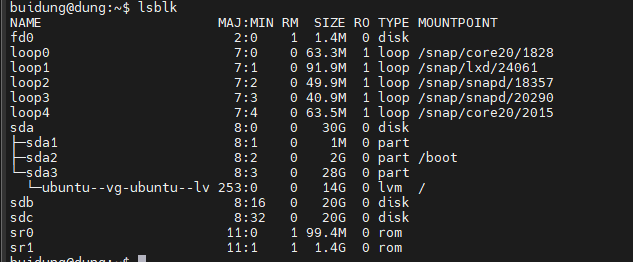

- Để mount một filesystem ta sử dụng cấu trúc câu lệnh như sau: 

  ```
  mount [options] {device name}
  ```
- Để unmount một filesystem ta sử dụng cấu trúc câu lệnh như sau: 
  
  ```
  unmount [option] {mount point}
  ```

## Linux Directory Structure: 
  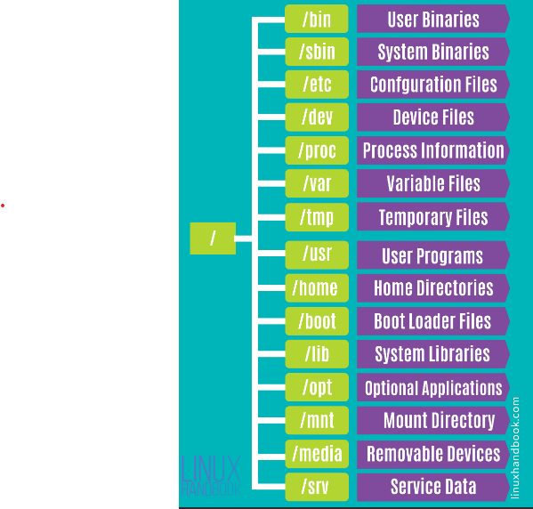


## LVM (Logical Volume Manager): 
- LVM là một phương pháp mới cho việc quản lý storage system thay thế cho các phân vùng truyền thống. Trong LVM thay vì tạo các phân vùng, ta sẽ tạo các logical volume và sau đó ta có thể dễ dành mount những volume này vào trong filesystem của mình giống việc mà ta đang thực hiện phân vùng.
  
- **Lưu ý**: ta không thể dùng logical volumes cho phân vùng `/boot` bởi vì phần bootloader của linux không hỗ trợ logical volume.
  
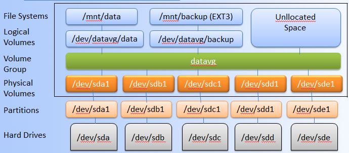
- Các thành phần của LVM: 
  1. Physical Volumes 
  2. Volume Groups
  3. Logical Volumes
- **Physical Volumes:** là những đại diện vật lý hoặc phân vùng đĩa của mình chẳng hạn như `/dev/hda`, `/dev/sdb1`. Ta có thể kết hợp nhiều Physical Volumes lại để tạo thành Volume Groups để dễ dành trong việc quản lý và phân chia.
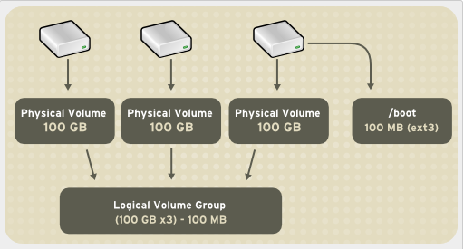
- **Volume Group:** là một nhóm nhiều Physical Volumes tạo thành. Một Volume Group có thể bao gồm nhiều các Physical Volumes trên các ổ đĩa khác nhau.   

- **Logical Volumes**: Volume group được chia nhỏ thành nhiều logical volumes mỗi logical volume có tác dụng tương tự như partition có thể được dùng cho các mountpoint với các file system khác nhau.
  
- Việc sử dụng LVM có tác dụng chính là ta có thể dễ dành thay đổi kích thước một logical volumes hoặc một volume group. LVM loại bỏ các khái niệm về partitions hay là disk mà thay vào đó đưa cho ta một central pool storage để làm việc.


## Lab for LVM:

### 1. Kiểm tra các hard disk đang có:
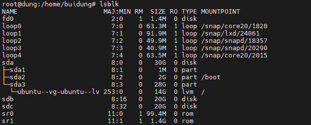


### 2. Tạo các phân vùng cho hard disk sử dụng fdisk:

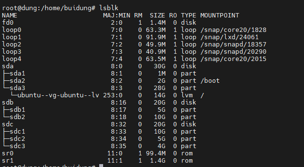

### 3. Tạo Physical Volume: 

- Tạo các Physical Volume là /dev/sdb1, /dev/sdb2, /dev/sdc1,.....

  ```
   pvcreate /dev/sdb1
  ```
- Kiểm tra các physical volume đã tạo được: 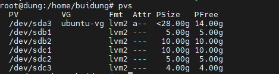
  
### 4. Tạo Volume Group:
- Từ các Physical Volume đã được tạo ta có thể nhóm chùng thành một nhóm
   ```
      vgcreate vg-demo /dev/sdb1 /dev/sdb2 /dev/sdc1 /dev/sdc2 /dev/sdc3
   ```
  
- Thực hiện kiểm tra volume group đã được tạo: 
  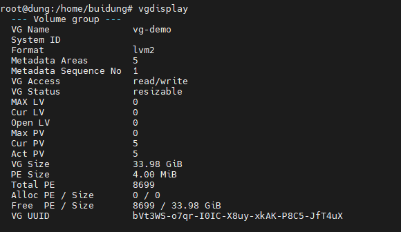

### 5. Tạo Logical Volume

- Từ một Volume Group ta có thể tạo được một Logical Volume:
  ```
     lvcreate -L [size_of_volume] -n [name of volume] [name of volume group]
  ```
- Kiểm tra kết quả 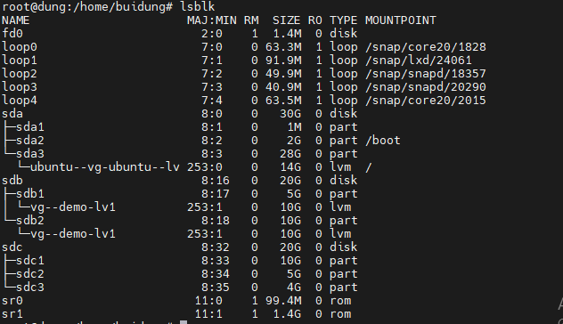

### 6. Định dạng logical volume vừa tạo:

- Định dạng logical volume vừa tạo với ext4:
  ```
    mkfs -t ext4 /dev/vg-demo/lv1
  ```
- Kiểm tra lại: 
  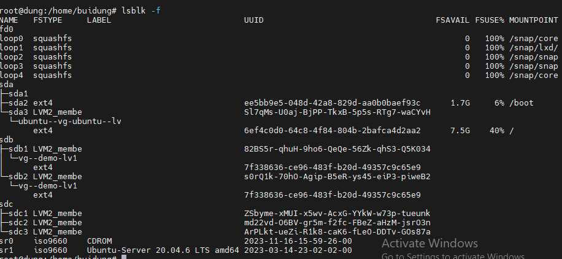

### 7. Mount và sử dụng:
- Tạo thư mục `lvmdemo` và mount logical volume vừa tạo vào thư mục này
  ```
    mount /dev/vg-demo/lv1 lvmdemo
  ```
- Kiểm tra kết quả bằng lệnh `df -h`: 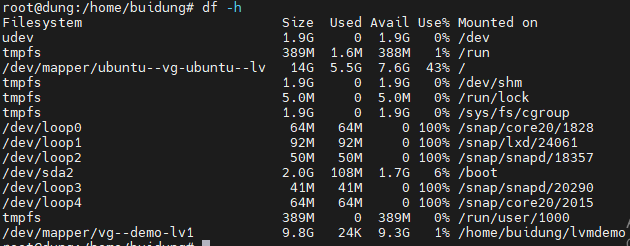
  