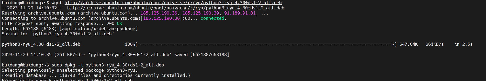
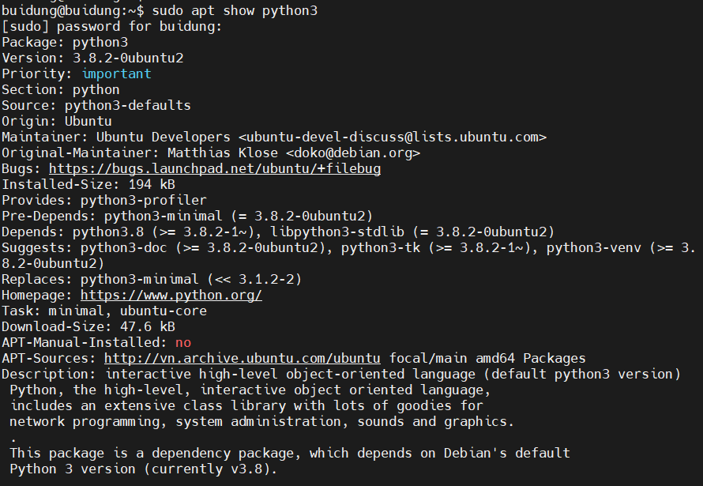
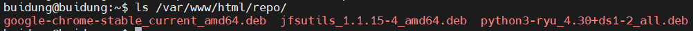
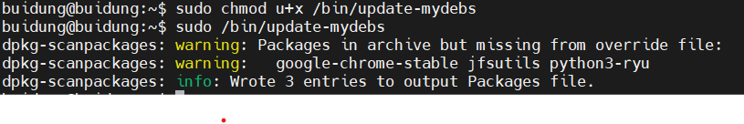
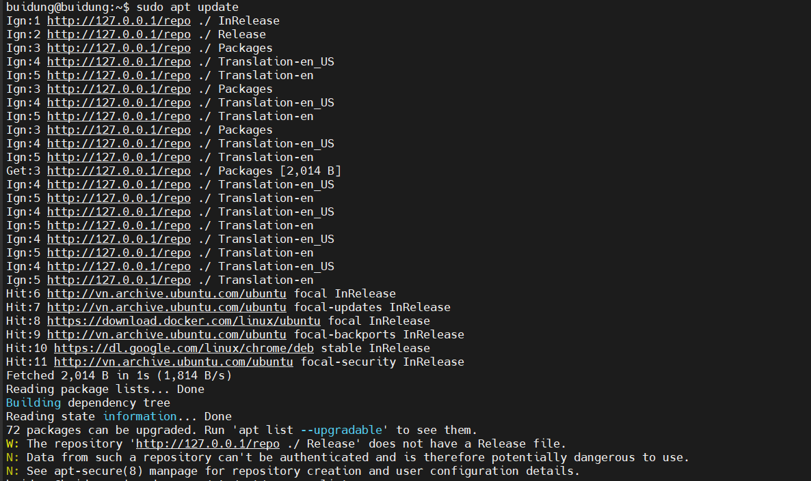
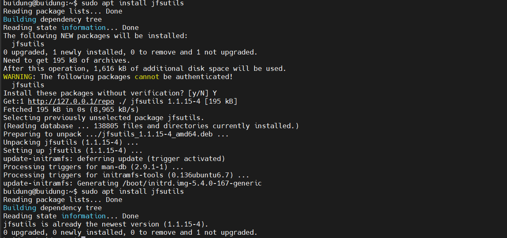

# Package management in Linux

## Package là gì ?
- Package được hiểu là tập hợp tất cả các files, metadata và các thông tin được hệ điều hành sử dụng để chạy một software application. Với các distros của Linux, ta có thể dùng các packages để cài đặt, bảo trì các phần mềm.
- Vì mỗi thiết bị chạy Linux lại có một kernel khác nhau, nên không thể đảm bảo được việc một chương trình Linux có thể chạy được trên tát cả các thiết bị chạy Linux. Vì vậy, package ra đời để giải quyết việc như vậy. Trong package có các **dependencies** tức là danh sách các thư viện, phần mềm cần phải có trước khi cài đặt một phần mềm.
### Các loại Packages trong Linux:
1. Distro-native Package:
   - Là các packages có được quản lý bởi các package manager như là **apt**, **yum**, **dnf**.Thông thường Distro-native Package sẽ có 2 loại chính đó là:
     - Debian Packages: thường được sử dụng ở những bản phân phối Linux được xây dựng dựa trên Debian và có đuôi **.deb** ở mỗi packages. Các dependencies trong Debian Packages được quản lý với các package managers như là **apt**, **apt-get**
     - RPM Packages: Các packages này thường được sử dụng trên các bản phân phối Linux được xây dựng dựa trên RedHat và có đuôi **.rpm**. Các dependencies trong RPM Packages được quản lý với các package managers như là **Yum** và **Dnf**.
2. Containerized Package: 
   - Là các package chứa các dependencies và ứng dụng được đóng gói trong một container có thể chạy độc lập trên nhiều môi trường khác nhau mà không bị conflict với cấu hình mặc định của hệ thống. 
   - Các containerized package phổ biến:
     - Snap: gồm ứng dụng và các dependencies của ứng dụng đó được đóng gói lại để có thể chạy trên nhiều các hệ điều hành Linux khác nhau. Snap có một centralized repos là **Snap Store** nơi lưu trữ tất cả các package. Snap Store giúp user có thể tìm và cài đặt các ứng dụng.
     - AppImage: AppImage là một executable file tương tự với file **.exe** ở Windows. Người dùng không cẩn phải cài đặt AppImage. AppImage dùng để chuyển 1 ứng dụng và các dependencies của nó thành một file duy nhất.
     - Flatpak tương tự như Snap cũng thực hiện đóng gói ứng dụng và các dependencies tương ứng vào trong một container để dễ dàng chạy một cách an toàn mà không phụ thuộc vào cài đặt của hệ thống. Ngoài ra Flatpak còn có khả năng tự động cập nhật ứng dụng từ kho lưu trữ riêng khiến cho người dùng luôn được sử dụng phiên bản mới nhất và an toàn nhất.

## YUM và APT: 
### Repository là gì ?
- Repository là được hiểu là kho chứa các software package có sẵn. Repo được chia ra làm 3 loại:
    + Local repo: là repo có sẵn ở trong máy local.
    + Centralized Internal repo: là repo được lưu ở một server trên mạng LAN, chưa một hoặc nhiều các packages.
    + Vendor repo: Là các repo có trên Internet, được sở hữu bới các distribution vendor.
### YUM:
- **rmp**: là một phiên bản cấp thấp dùng để quản lý các package cho những hệ điều hành Linux được xây dựng bởi RedHat. rmp có tác dụng cài đặt, gỡ cài đặt với các software package có đuôi **.rmp** 
   - Các options hay dùng khi sử dụng rmp:
     Options| Mục đích
     ---|---
     `-i {package name}`| Cài đặt package. 
     `-e {package name}`| Xóa hoặc gỡ cài đặt package.
     `-v`| bật verbose mode để cung cấp thêm thông tin về package.
     `-V {package name}`| Xác nhận rằng những thành phần của package đó có sẵn.
   - Ngoài ra còn có các câu lệnh hỗ trợ phổ biến khác như là:
     Câu lệnh| Mục đích 
     ---|---
     `rpm -qa {package name}`| List tất các các phần mềm đã được cài đặt.
     `rpm -qi {package name}` | List những thông tin về package.
     `rpm -qf {path/to/file}`| Tìm package mà file đó thuộc về.
     `rpm -ql {package name}` | Liệt kê các file thuộc package đó.
     `rpm -qc {package name}` | List những file cấu hình của package.

- YUM (Yellowdog Updater Modified): là một package manger phiên bản nâng cấp hơn của rmp được sử dụng cho những hệ điều hành Linux được xây dựng bởi RedHat. YUM là một ứng dụng front-end để quản lý các RPM package (quản lý các package có đuôi **.rpm**) có ở trong các repos. 
- Quản lý các package trong YUM:
   - Có rất nhiều các options và các command có sẵn được sử dụng với YUM. Sau đây là một số các command thông dụng và hay được sử dụng với YUM:
    
      ``` 
       yum -option command {package name}
      ```

    Command| Mục đích
    ---|---
    `yum install {package name}`| Dùng để cài đặt các package có sẵn từ các repo.
    `yum localinstall {package name}`| Dùng để cài đặt các package từ local repo.
    `yum search {package name}` | Dùng để tìm kiếm các thông tin về package theo từ khóa.
    `yum info` | Liệt kê các thông số của package.
    `yum update` | Cập nhật các package đến phiên bản mới nhất.
    `yum provides {file name}` | Xem file hoặc thư viện này thuộc package nào.
    `yum history` | Dùng để xem lại thông tin của các lần thực hiện trước.Ví dụ như là ngày tháng cài đặt, xóa các package.
    `yum upgrade` | Một phiên bản rộng hơn của update có thể cập nhật tất cả package đã được cài đặt cũng như các ứng dụng cảu hệ thống. 


    Options| Mục đích:
    ---|---
    `-y`| Tự động trả lời có để cài đặt các additional software dependencies. 
    `--skip-broken`| Bỏ qua các packages mà bị lỗi.
    `-V`| Sử dụng chế độ Verbose.
    `-C` | Chạy từ system cache.

- Ngoài ra còn có một công cụ quản lý package tương tự với `yum` và `rpm` đó là **dnf**. **dnf** hỗ trợ rpm, sử dụng ít tài nguyên hơn với những tính năng tương tự để quản lý các package như là cài đặt, gỡ cài đặt các package,.....

  - Cấu trúc câu lệnh của dnf là: 
    ```
      dnf [command] [file name]
    ```     
  - Để xem chi tiết hơn về dnf sử dụng `man dnf`.
 
### APT:
1. **dpkg**: là một phiên bản cấp thấp để quản lý các package trong những bản phân phối của Linux được xây dựng dựa trên Debian. **dpkg** là một công cụ dùng để cài đặt, buld, remove và quản lý các Debian packages. 
- **dpkg** được sử dụng cho các package có đuôi `.deb`.
- Cấu trúc câu lệnh của dpkg:
  ```
    dpkg [option] [.deb package name]
  ```
- Các option hay sử dụng trong câu lệnh với dpkg:
  Option| Mục đích
  ---|---
  `-i` hoặc `--install`| Cài đặt một package. Câu lệnh này sẽ giải nén tất cả các control files của package đó. Và dựa còn control files này để remove tất cả các phiên bản cũ của package đó và cài phiên bản mới nhất trên hệ thống.
  `-r` hoặc `--remove`| Remove tất cả các files liên quan đến package ngoại trừ các file config.
  `-P` hoặc `--purge` | Cũng là remove tất cả các file liên quan đến package nhưng câu lệnh này sẽ xóa hoàn toàn bao gồm cả các file config.
- Sử dụng câu lệnh dpkg:
  Ta tiến hành tải package ryu.deb về máy qua lệnh `wget` và tiến hành cài đặt sử dụng dpkg.

  

2. APT (Advanced Package Tool):
- Là một phiên bản nâng cấp và được xây dựng trên dpkg. **apt** cung cấp một high-level command interface cho người dùng cho việc quản lý các package. Việc này khiến cho việc quản lý các package được dễ dàng và thuận tiện hơn so với việc sử dụng `dpkg`.
- Ngoài ra còn có các phiên bản khác như là `apt-get` và `apt-cache` cung cấp nhiều option hơn so với apt và được sử dụng phổ biến hơn do sự tương thích, sử dụng được trong nhiều phiên bản linux khác nhau.
- Sau đây là một số câu lệnh hay được sử dụng của apt: 
  - Cập nhật package index: APT package index được hiểu là một cơ sở dữ liệu chứa các bản records của các package có sẵn từ repo của hệ thống.
  ```
    sudo apt update
  ``` 
  - Nâng cấp phiên bản packages: Sau khi đã cập nhật được các phiên bản mới của các package để upgrade tất cả các phiên bản đó ta sử dụng (Ngoài ra, ta có thể upgrade một package bằng cách truyền tên của package đó vào sau câu lệnh trên):
  ```
    sudo apt upgrade {package_name} 
  ```

  - Cài đặt package: ta có thể cài đặt một hoặc nhiều package một lúc. Để cài đặt local deb files thì ta chỉ việc truyền đường dẫn của deb files đó vào câu lệnh trên.
  ```
    sudo apt install {package_name1} {package_name2}
  ```
  
  - Gỡ package: Để gỡ các package đã được cài đặt ta sử dụng:
  ```
    sudo apt remove {package_name1} {package_name2}
  ```
  - Tuy nhiên câu lệnh trên chỉ gỡ cài đặt những package được nêu nhưng vẫn chưa thể xóa được các file config của các package đó. Để xóa hoàn toàn một package ta sử dụng câu lệnh sau:
     ```
       sudo apt purge {package_name}
     ``` 
  - Để gỡ các dependencies mà ta không sử dụng nữa sử dụng câu lệnh:
  ```
    sudo apt autoremove
  ```
  - Để liệt kê các package có sẵn, đã được cài đặt, các package có thể được upgrade:
  ```
    sudo apt list
  ``` 
  Câu lệnh sẽ in ra tất cả các thông tin của package bao gồm thông tin về phiên bản, thời gian cài đặt, kích thước của một package,... Ngoài ra để chỉ xem các package đã được cài đặt hay xem các package có thể upgrade được ta chỉ lần lượt thêm các trường `--installed`, `--upgradeable` vào sau.
  
  - Để tìm kiếm một package từ list các package có sẵn trong hệ thống ta sử dụng câu lệnh:
  
  ``` 
    sudo apt search package_name
  ```

  - Để xem thông tin chi tiết về package:
  ```
    sudo apt show package_name 
  ``` 

  


# Repo và mirror trong linux 

### Repo là gì ?
- Repo hay là Repositories là vị trí lưu trữ của các software package. 
- Repo bao gồm 3 loại chính:
  1. **Local repo**: là repo được đặt ở trong máy local.
  2. **Centralized Internal repo**: là các repo được lưu ở một hay nhiều server. Người dùng trong mạng LAN có thể kết nối và lấy được các package của các repo này.
  3. **Vendor repo**: được quản lý bởi các vendor trên Internet. Bằng cách kết nối Internet, ta có thể tải và cài đặt các package có trong vendor repo.
- Tất cả các repo 
### Mirror là gì ?
- Mirror được định nghĩa là các bản sao chép của các repo từ một nơi này đến một nơi khác. Một *mirror* có thể được tạo ra để duy trì một bản sao phản ánh hoặc đồng bộ với kho lưu trữ gốc để tối ưu hóa việc truy cập cho người dùng cục bộ. 
- Ngoài ra việc tạo mirror có thể đảm bảo an toàn cho mã nguồn khi repo gốc gặp sự cố.

### Tạo local repo với yum và apt:

- Đối với yum:
  - B1: Tạo một thư mục có tên là *localrepo*:
    ```
      sudo mkdir /path/to/localrepo
    ```
  - B2: Sao chéo các gói RPM vào thư mục localrepo:
    ```
      sudo cp /path/to/your/packages/*.rpm /path/to/localrepo
    ```
  - B3: Tạo các metadata cho localrepo với lệnh `createrepo`:
    ```
      sudo createrepo /path/to/localrepo
    ```
  - B4: Cấu hình file localrepo.repo trong thư mục `/etc/yum.repos.d`:
    ```
       [localrepo]
       name=Local Repository
       baseurl=file:///path/to/localrepo
       enabled=1
       gpgcheck=0
    ```
    Trong đó, **[localrepo]** là tên của repo, **name** là tên mô tả của repo, là tên mà yum sẽ hiển thụ khi sử dụng các lệnh liên quan đến repo như `yum repolist`, **baseurl** là URL hoặc đường dẫn đến repo mà mình tạo, **enabled** là trường dùng để xác định xem repo có hoạt động hay không(giá trị 1 là repo được kích hoạt, còn giá trị 0 là repo bị vô hiệu hóa), **gpgcheck** là trường để xác định xem yum có kiểm tra chữ ký GPG(GNU Privacy Guard) hay không(giá trị 1 là có kiểm tra, còn giá trị 0 thì không kiểm tra).
  - B5:Kiểm tra và sử dụng local repo đã được tạo:
    ```
      sudo yum repolist
    ```
- Đối với apt:
  -  B1: Cài đặt Apache Web Server:
    ```
      sudo apt-get install apache2
    ```
  -  B2: Tạo thư mục `repo` trong Apache doucement root để host local apt repo:
    ```
      sudo mkdir /var/www/html/repo
    ```
  -  B3: Copy file .deb ở home vào trong thư mục vừa tạo:
    ```
      sudo cp *.deb /var/www/html/repo
    ``` 
  -  B4: Kiểm tra lại trong thư mục repo:
    ```
      ls /var/www/html/repo/
    ```
     

  -  B5: Viết Script file để có thể scan và update được file Packages.gz:
    Tạo script file:  
    ```
      sudo nano /bin/update-mydebs
    ```   
    Thêm lệnh vào script file:
    ```
     #!/bin/bash
     cd /var/www/html/repo
     dpkg-scanpackages . /dev/null | gzip -9c > Packages.gz
    ```
    Cấp permission cho file vừa tạo:
    ```
      sudo chmod u+x /bin/update-mydebs
    ```
    Chạy file script:
    ```
      sudo /bin/update-mydebs
    ```
    
  - B6: Cấu hình Apache phục vụ repo:
    ```
      sudo nano /etc/apache2/sites-available/000-default.conf
    ``` 
    Thêm cấu hình cho localrepo:
    ```
      Alias /localrepo /var/www/html/localrepo
      <Directory /var/www/html/localrepo>
         Options Indexes FollowSymLinks
         AllowOverride None
      Require all granted
      </Directory>
    ```
    Sau đó, restart lại service apache.
  - B6: Thêm APT repo vừa tạo vào `/etc/apt/sources.list`
   ```
    # Local APT Repository
    deb [allow-insecure=yes] http://127.0.0.1/repo ./   
   ```  
  - B7: Upadte các package:
    ```
      sudo apt update
    ```
    
  - B8: Thực hiện cài đặt jfsutils có trong repo:
    ```
      sudo apt install jfsutils 
    ```
    