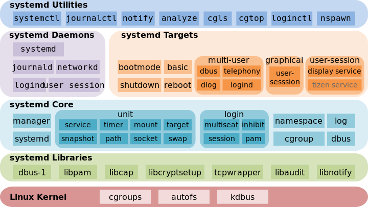

# System startup and shutdown

## Boot process
### Các khái niệm:
- Booting là chỉ sự hoạt động của 1 tiến trình khi tiến hành khởi động hoặc restart một máy tính cũng như tải một hệ điều hành.
- Boot loader là một chương trình nhỏ được lưu ở trong ROM thực hiện nhiệm vụ tải lên kernel từ một thiết bị lưu trữ, boot loader bảo vệ quá trình boot bằng một mật khẩu.
- Boot loader bao gồm 3 thành phần:
1. Boot sector program: có nhiệm vụ chính là khởi động quá trình boot của hệ thống. Khi bật máy tính, boot sector đầu tiên sẽ được tải từ ổ cứng hoặc ổ đĩa. Boot sector chứa các hướng dẫn cần thiết để khởi động hệ điều hành.
2. Second Stage Boot Loader: là một phần mở rộng của boot sector ban đầu, sau khi boot sector hoàn thành việc khởi động ban đầu, second stage boot loader sẽ thực hiện việc nạp hệ điều hành, khởi động hệ điều hành.
3. Boot Loader Installer: là công cụ hoặc chương trình được sử dụng để cài đặt boot loader vào máy tính, giúp cài đặt boot loader vào vị trí đúng đắn trên ổ đĩa cứng và cấu hình nó để khởi động hệ điều hành.
### Các options khi boot hệ điều hành:
1. **BIOS**(Basic input output system): là một firmware thường được nằm trên ROM của bo mạch chủ, cung cấp các cách thức để hoạt động và tương tác giữa phần cứng và phần mềm trong máy tính.
2. **UEFI**(Unified Extensible Firmware Interface): là một firware mới thay thế cho BIOS truyền thống. UEFI cung cấp nhiều tính năng hơn so với Bios như là: cung cấp GUI, có khả năng mở rộng, bảo mật,....
- Ngoài ra còn có các Boot options khác như là từ file `.iso` image là boot từ Network File System.
### Quá trình boot trong linux:

- Quá trình boot của hệ điều hành linux được thể hiện bên trên bao gồm các bước:
1. **Power On**: thực hiện cấp nguồn điện cho các thiết bị trong máy tính.
2. POST(Power-on-Self-Test): các thiết bị trong máy tính sẽ tự kiểm tra xem nguồn điện vừa được cấp có phù hợp không
3. **BIOS**: Thực hiện nhiệm vụ xác nhận tất các các thành phần được gắn và xác định thứ tự boot của các thiết bị, dựa vào thứ tự đó mà BIOS sẽ thực hiện boot cái gì trước.

     

4. **MBR**(Master Boot Record): bao gồm boot loader, thông tin về partition và magic blocks  thường có kích thướng là 512 byte. Trong đó: 446 byte được cấp cho phần boot loader, 64 byte là thông tin về partition sẽ cung cấp hoặc chuyển hướng đến phân vùng `/boot` để tìm GRUB2.
5. **GRUB**(Grand Unified Boot Loader): là một file cấu hình được đặt ở `/boot/grub2/grub.cfg` thực hiện chỉ đến **initramfs**. Initramfs sẽ tải các block device drivers như là SATA, RAID,... Initramfs là phần bao bên ngoài của kernel, và kernel được mount đến initramfs.
6. **Kernel**: GRUB2 sẽ gọi đến boot menu khi quá trình boot được tiến hành và kernel sẽ được tải. Khi Kernel tải thành công nó sẽ lập tức tiến hành các tiến trình và dịch vụ khác.
7. **Khởi động Systemd-tiến trình đầu tiên của hệ thống**: Khi systemd được khởi tạo nó thực hiện khởi động tất các system service. Trước systemd sẽ không có các tiến trình nào khác, systemd được khởi động bằng cách gọi hàm `fork()`, hệ thống fork sẽ gán PID cho systemd là 1. Systemd được khởi chạy ở thư mục `/etc/systemd/systemd/default.target`. 
8. **Thực hiện khởi động các serive trong default.target**: các service khác sẽ được khởi động lần lượt theo thứ tự ở trong default.target, càng nhiều service thì quá trình khởi động càng chậm.
- Để xem được quá trình khởi động mất bao lâu ta thực hiện:
  ```
    sudo systemd-analyze time
  ```
  

## systemd vs sysVinit(systemV):
### Service:
- Service là các tiến trình hoặc chương trình cung cấp khả năng hỗ trợ các yêu cầu và theo dõi từ các tiến trình khác.
- Hầu hết các service trong linux đều được triển khai ở dạng daemons.
- Daemons có thể được coi là các chương trình chạy ngầm trong hệ điều hành, cung cấp các tác vụ hệ thống cho các application hoặc người dùng.
- init process là backend service để điều khiển khi nào thì các service được khởi tạo và các service được khởi tạo như thế nào.
- init daemon là file cấu hình để khởi tạo các service được liệt kê trong đó (các service này sẽ được chạy đến khi nào mà hệ thống không còn khả năng hoạt động nữa thì thôi).
### systemd: 
- Là một chương trình cung cấp các phương thức khởi tạo, quản lý cho các service, systemd được sử dụng một cách phổ biến trong hầu hết các phiên bản distribution của Linux.


- Trong systemd, units là các tài nguyên mà systemd có thể quản lý như là các services, sockets, devices, mount,... Mỗi một loại unit đều được tương ứng với một loại resource đặc biệt:
  1. service unit(`.service`): Unit này điều khiển các daemons và các background services. Nó định nghĩa cách mà một service được khởi tạo, được dừng, enabled hay disabled như thế nào, và cách quản lý các service đó.
  2. socket unit(`.socket`): socket unit được sử dụng để thiết lập và quản lý sự giao tiếp giữa các tiến trình thông qua các socket. Các tiến trình có thể kích hoạt các tiến trình liên quan khi socket được thiết lập
  3. device unit(`.device`): Device unit đại diện cho các kernel devices, systemd có thể thiết lập các cấu hình cho các devices này hoặc take action khi mà các device này trở nên available hoặc unavailable.
  4. mount unit(`.mount`): Mount unit quản lý các mount point trong các file system.
  5. target unit(`.target`): Các units này dùng để nhóm các units khác lại với nhau, hoạt động như một điểm để đồng bộ hóa các unit với nhau.\
  6. timer unit(`.timer`): Timer unit có thể kích hoạt các hoạt động ở một thời điểm nào đó hoặc theo một khoảng thời gian định kỳ.
- Mỗi loại unit đều có file cấu hình riêng, nhưng file này định nghĩa systemd quản lý các resource liên quan đến các unit này như thế nào.
- Ta có thể quản lý các unit bằng câu lệnh systemctl:
  ```
     systemctl [command] [service name]
  ```
  Command|Tác dụng
  ---|---
  status| xem trạng thái của service.
  enable| cho phép service hoạt động.
  disable| không cho phép service hoạt động.
  start| khởi động service.
  restart| khởi động lại service.
  stop| dừng service.
- Ngoài ra ta có thể liệt kê những unit dependencies của một service bằng cách sử dụng câu lệnh: 
  ```
    systemctl list-dependencies {service_name.service}
  ```
  
- Đôi khi một hệ thống có thể có nhiều service các service này khi được cài đặt có thể bị conflict với nhau, việc sử dụng chế độ mask trong systemctl có thể ngăn chặn người quản trị có thể khởi động một service mà gây conflict với service khác. Để mask một service ta sử dụng câu lệnh:
  ```
     systemctl mask {service_name.service}
  ```
  Để khởi động lại service đó ta bắt buộc phải `unmask` trước khi `start`.
### sysVinit(systemV):
- Một phiên bản cũ hơn cũng cung cấp các phương pháp khởi tạo cho các service nhưng đã gần như bị thay thế bởi systemd.
- Khác với systemd, sysVinit sử dụng cơ chế runlevels để xác định loại daemons nào sẽ được chạy.

- Các phiên bản đistribution Linux khác nhau thì có runlevels mặc định khác nhau. Ví dụ một số hệ thống mặc định ở runlevel 3 (Multiuser Mode with Networking), còn một số hệ thống lại được mặc định ở runlevel 5 (Multiuser with GUI).
- Để chuyển sang các runlevels khác nhau sử dụng câu lệnh `telinit`.

## Scripts trong startup/init: 
- Scripts ở đâu được hiểu là 1 file bash dùng để tự động hóa việc khởi động các service hay các ứng dụng khi khởi động máy tính.
- Đến đây mình sẽ thực hiện tự động tạo thư mục test ở `home/buidung` sau 1 lần reboot thông qua file rc.local:
   1. Thực hiện edit file `rc.local`: 
    ```
      sudo nano /etc/rc.local
    ```
   2. Thêm dòng script dưới đây vào file rc.local:
    ```
       #!/bin/bash

       mkdir /home/buidung/test1

       exit 0
    ```
   3. Sau đó lưu lại file và cấp quyền execution cho file rc.local:
    ```
      chmod u+x /etc/rc.local
    ``` 
   4. Thực hiện reboot lại máy và kiểm tra lại:
    

